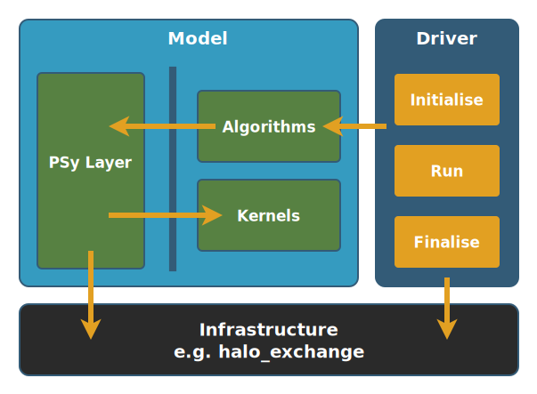

.. -----------------------------------------------------------------------------
     (c) Crown copyright 2024 Met Office. All rights reserved.
     The file LICENCE, distributed with this code, contains details of the terms
     under which the code may be used.
   -----------------------------------------------------------------------------

.. _psykal and datamodel:

LFRic Science Model Architecture
================================

This section describes the :ref:`PSyKAl <psykal overview>` architecture which
governs how :ref:`science model <glossary_of_terms>` codes at the heart of a
full :ref:`LFRic application <glossary_of_terms>` are written. The PSyKAl
architecture inspired the design of :ref:`LFRic fields <field>`, and the design
of the `PSyclone <https://psyclone.readthedocs.io/en/stable/index.html>`_ tool
which is used to generate some of the application code.

PSyKAl describes a way of achieving a separation of concerns between scientific
code and technical code. The scientific codes are kernels and algorithms
represented by the "KAl" in the name. Algorithms call kernels through the
technical code, called the Parallel System or "PSy layer" code which is the code
that PSyclone can generate. The PSy layer code can deal with issues relating to
distributed and shared memory paralellism.

A benefit of such separation is that technical changes to code required by
different platforms or compilers can be isolated to the PSy layer. Further, if
PSyclone can generate all this code for any choice of platform, the same science
code can quickly be ported between them: the system delivers "portable
performance". For example, PSyclone can generate code with or without OpenMP
directives, and work is underway to enable PSyclone to generate code that will
run parts of an application on GPUs.

The section begins by explaining key features of LFRic fields, including
describing how they support unstructured meshes and mixed finite element
fields. It then moves on to more complex examples of PSyKAl including examples
based on real code from LFRic applications and real code generated by
PSyclone. The section will not describe all of PSyclone's capabilities as there
is separate, comprehensive `PSyclone documentation
<https://psyclone.readthedocs.io/en/stable/index.html>`_.

.. _lfric concepts:

Key Concepts and Requirements
-----------------------------

Overview of the architecture
^^^^^^^^^^^^^^^^^^^^^^^^^^^^

LFRic supports a wide range of data structures designed for holding the full
model state of a large and complex earth system model. The PSyKAl design
interacts mainly with the core part of this data model: the model :ref:`fields
<field>`.

Finite difference fields used in many earth system models, including the Unified
Model, are relatively simple native Fortran arrays containing quantities or
vectors that are implicitly mapped to localised points on a regular model
grid. The LFRic atmosphere model uses the GungHo formulation for its dynamical
core. GungHo introduces a mixed finite element scheme: fields are represented by
a combination of data points on the entities of a mesh and a set of functions
known as "basis functions". Meshes are described formally, and are typically
unstructured. To support the new requirements, the LFRic field is a Fortran type
that, among other properties, encapsulates all these aspects of the field.

Broadly, LFRic supports the following abilities to create and manipulate model
fields:

-  Functions that support creation, parallelisation and manipulation of
   model fields used in the mixed finite element scheme of the GungHo
   dynamical core, as well as finite difference fields.

-  Support for creating fields on formally-described meshes, and support for
   partitioning these fields to provide the ability to run the model with MPI
   parallelism.

-  For parallel deployment, support for halos and stencils, and monitoring the
   state of halos (whether or not they are "dirty" such that they need a "halo
   swap" to update them before being used).

-  Base classes for kernels and operators that take fields as arguments.

.. _psykal:

   **The PSyKAl Design**: Schematic of the LFRic design recommendation
   illustrating the PSyKAl design for the science "Model" code,
   the driver layer and supporting infrastructure.

The :ref:`PSyKAl design <psykal>` is a 3-layered design shown above.
The separation of concerns between scientific
code and parallel code is delivered by separating the "Parallel
Systems", or **PSy Layer** code from the higher-level scientific
"Algorithm" code which operates on global data from lower level
"kernel" code which operates on small chunks of the global data.  The
PSy layer code breaks the global data down into chunks and passes the
chunks to the kernels, applying any requested parallel computation
strategies.

The appropriate method for "chunking" data depends on the operation and
the application. Basic arithmetic operations like addition and
multiplication need simply to loop over individual data points. Finite
element methods, however, tend to operate on whole cells of data in one
operation, and each cell can have more than one data point. Rather than call a
kernel once per cell, though, LFRic fields can store columns of cell data
contiguously which means that kernels can be written to loop over all the cells
in a column for each call. Storing data this way supports the kernels written to
implement the GungHo dynamics.

By using metadata to define kernel interfaces precisely, it is possible
to automatically generate PSy layer code; PSyclone has been
developed to do this. PSyclone generates correct code which can include
transformations that apply a range of parallel strategies and other
optimisations.

PSyclone is written to support other applications in addition to LFRic.
The specific standard that supports code generation for LFRic
applications is referred to (for historical reasons) as the Dynamo0.3
API. This API is documented in a section of the general `PSyclone
documentation <https://psyclone.readthedocs.io/en/stable/index.html>`_.

.. _w2_w3_vert_3d:
.. figure:: images/w2_w3_vert_3d.svg
   :width: 80%

   **Numbering of data points**: An illustration of two fields on the
   same mesh. The mesh has three cells in the horizontal and four
   vertical levels. On the left data points are on each face of the
   cell and on the right the data points are in the centre of the
   cell. In both cases, points are numbered consecutively in the
   vertical. The numbering scheme for the field on the left takes into
   account hidden faces between and behind the cells. For example, the
   four faces between the left and middle column of the left-hand
   figure could be numbered 5 to 8. The five faces on the bottom and
   top of the cells in the column of on the right would be numbered 51
   to 55, but only the top face, 55, can be seen.

In support of the GungHo finite element method, the LFRic
Infrastructure can create fields whose innermost index
comprises data points in vertical columns. The figure above
illustrates :ref:`numbering of data points <w2_w3_vert_3d>` for two
types of fields.

While the finite element and finite difference methods are not the
same, some useful analogies can be made. The field in the right-hand
figure could be used to store fields such as density which are
situated on half-levels in the Charney-Phillips grid that describes a
common method for vertical staggering of different physical
variables. The left-hand field could be used for storing both
staggered horizontal winds as in what is referred to as the Arakawa
C-grid, and vertical wind fields as in the Charney-Phillips grid.

The looping strategy that PSyclone applies to such fields is to loop over cells
at the surface, passing a map that holds references to all the data points on
each surface cell into the kernel. The kernel can loop over the individual cells
of the column by incrementing each of the map references to step through each
cell in the column. A worked example based on the above figure is given :ref:`in
a later section <dofs>`.

Definition of Meshes and mesh entities
^^^^^^^^^^^^^^^^^^^^^^^^^^^^^^^^^^^^^^

@todo this should be replaced by a reference to mesh documentation.

A **mesh** is a formal description of a grid used by a model, and
comprises locations of points (referred to as vertices or nodes) and
connectivity between points. An LFRic application reads in 2D meshes
from a file. The figure below shows a :ref:`2D mesh <cubesphere_2x2>`
representing the surface of a cube comprising 6 faces each with 2 by 2
cells. The connectivity will be represented by mappings between, for
example, each face number and the edge numbers of the edges
surrounding the face.

LFRic computes 3D meshes from the 2D mesh by extruding the 2D cells
into vertical columns of 3D cells, thereby constructing a mesh with a
set of connected vertical layers.

This documentation references the following mesh entities of the 3D
mesh:

-  Vertex or node -- A zero-dimensional point in space.

-  Edge -- A connection between two vertices. The vertices and edges
   define the mesh topology.

-  Face -- A connection between three or more vertices that defines a
   surface enclosed by three or more edges. Note that while LFRic
   infrastructure could be extended to support triangular cells,
   currently all LFRic applications use quadrilateral cells with 4
   vertices and 4 edges per face.

-  Cell volume -- A volume enclosed by a set of faces.

A 3D cell refers to both the cell volume and the entities (faces, edges
and vertices) that enclose the volume. Neighbouring cells can share the
faces, edges and vertices. For example, immediate neighbours of a
cubed-sphere mesh share a face, four edges and four vertices.

.. _cubesphere_2x2:
.. figure:: images/cubesphere_2x2.svg

   **A 2D mesh**: Representation of a 2D cubed-sphere mesh, with
   numbering of cells, edges and vertices. Note that some vertices and
   edges are duplicated within the diagram. Duplicated vertices are
   given the same number.  For duplicated edges, only one of the
   representations is numbered.

.. _dofs:

Dofs, dof-maps and function spaces
^^^^^^^^^^^^^^^^^^^^^^^^^^^^^^^^^^

The LFRic Infrastructure supports finite difference (FD), finite volume
(FV) and finite element methods (FEM). Simply put, in FV and FEM, the
value of a field at any point within a cell is computed as the sum of
one or more  **basis functions** each multiplied by a different data
point. A basis function is a spatial function whose value varies within
the cell but is zero outside the cell. In FV and FEM terminology, each
data point is referred to as a  **degree of freedom** or **dof**.

The representation of the field as a combination of dofs and basis
functions is referred to as a **function space**. Formally, the value of
a field :math:`f` at point :math:`x,y,z` within a cell can be given
as:

.. math:: f(x,y,z) = \sum_{i=1}^n x_i \sigma_i(x,y,z)

.. note::

   In an unstructured mesh, cells can be of different sizes or be
   distorted. Therefore, the location :math:`x, y, z` will be a relative
   location based on an ideal reference cell.

Here, :math:`n` is the number of basis functions, :math:`\sigma_n` are
the basis functions, :math:`x_n` are the values of the degrees of
freedom. The :ref:`three figures below <basisorder2>` illustrate
how field values are computed from the dofs and function spaces for a
simple one-dimensional field with three basis functions. A
characteristic of a set of basis functions is that at the location of
each dof, the basis function associated with the dof is unity, and all
the other basis functions are zero. Therefore, the value of the field
at the location of the dof is the value of the dof itself.

Every cell in a given field has the same set of basis functions and the
same number of dofs in the same locations. A different field may have a
different function space and therefore a different set of basis
functions, and dofs at different locations.

.. _basisorder2:
.. figure:: images/basisOrder2.svg

   A set of basis functions (labelled A, B
   and C) for a 1D function space within a single cell that spans 0 to
   1 on the horizontal axis. The dashed vertical lines marks the
   centre of the cell and the right-hand border of the cell.

.. figure:: images/basisOrder2_dofs.svg

   The nominal location of three degrees of freedom
   (dofs). Multiplying each basis function from the first figure by the value
   of its related dof in this figure and summing the result gives a
   total displayed by the following figure.

.. figure:: images/basisOrder2_field.svg

   The value of the field within the whole
   cell. Note that the value intersects all three dofs. This is because
   each dof location is located where its related function is 1 and
   the other two functions are zero.

If a dof exists on a face, edge or vertex, then it is shared between the
cells that share that face, edge or vertex. Where dofs are shared
between cells, the field is continuous across the boundary between the
cells because the value of the field at the dof is the value of the dof
itself. A :ref:`continuous field <cg2_2d>` is illustrated
below: when approaching the dof
location from each side of the boundary between the cells, the value of
the field tends towards the same dof value.

For a :ref:`discontinuous field <dg2_2d>`, however, the
dofs are not shared between cells. While they
are at the same location as the edge, in this figure they are shown
slightly either side of the edge to illustrate the fact that they are
owned by one cell rather than being shared by two cells. As the two dofs
at the cells' boundaries can have different values to each other, it
allows the field to be discontinuous.

The continuity of a function space is important when considering the
strategy for applying an operation to a field. A field which is
discontinuous can be computed by treating each cell in isolation. But if
a field is continuous, then the computation on neighbouring cells
influence the value of shared dofs. In this circumstance, the order in
which cells are computed can affect the value, and if shared memory
parallelism is to be applied, strategies are needed to prevent the
computation of two cells contending to write to the same dof at the same
time.

In two dimensions, a continuous horizontal wind field can be represented
by dofs located on faces between horizontally neighbouring cells. This
representation is somewhat analogous to the finite difference C-grid
representation of wind as a vector whose direction is orthogonal to the
edge that separates one C-grid cell from another.

To generate correct parallel code, PSyclone needs to know which function
spaces are continuous and which are discontinuous in the horizontal. The
continuity of each of the available function spaces is explicitly
declared in the Dynamo0.3 API.

.. _cg2_2d:
.. figure:: images/CG2_2D.svg
   :width: 80%

   A continuous one-dimensional field, showing
   locations of dofs for each field. The vertical dashed line marks cell
   boundaries. The continuous field is described by dofs shared between
   cells, and so associated with the edge between the two cells.

.. _dg2_2d:
.. figure:: images/DG2_2D.svg
   :width: 80%

   A discontinuous one-dimensional field, showing locations of dofs
   for each field. The vertical dashed line marks cell boundaries. The
   dofs at the cell edges for the discontinuous field are at the same
   real location as those for the continuous field, but unlike the
   continuous field, they are not shared with the neighbouring
   cell. Their location is shown as being slightly off-set from the
   cell edge to illustrate their association with the cell volume.

The LFRic infrastructure will support finite difference fields. While
such fields do not have basis functions, for simplicity this document
will use the "dof" term to describe data points in these fields too.

Looping over columns of dofs
^^^^^^^^^^^^^^^^^^^^^^^^^^^^

To compute changes to a finite element field within a cell, a kernel
will need to operate on all of the dofs in the cell. In a regular mesh
such as a regular lat-lon mesh it may be possible to compute the
location within an array of all dofs belonging to a given cell based
on the cell location, enabling simple loops to be constructed that
step through all the data in the array. For a general unstructured
mesh, though, it is not possible to order data so it can be stepped
through in this way. Instead, for each type of field, look-up
tables are created that can be used to reference all dofs in each
cell. These look-up tables are referred to as **dof-maps**.

As noted in the section introducing :ref:`key concepts <lfric
concepts>`, LFRic stores dof-maps for the lowest cell of the 3D mesh
as the dof-maps for the cells in the next layer can be computed by
incrementing the dof-map addresses. The ability to infer the dofmaps
of successive cells in a vertical column enables kernels to be written
that operate on a column of cells based on the dof-map for just one
cell.

The illustrative examples given so far considered 1-dimensional and
2-dimensional fields and function spaces. GungHo, however, uses
3-dimensional function spaces that require dofs in the full
3-dimensional space of the cell: the :ref:`numbering of data points
<w2_w3_vert_3d>` in the figure above are used in the following example.

In the left-hand diagram of the figure, each cell has 6 dofs: one per
cell face, including some shared with another cell. Each dof is
related to one of 6 basis functions in this function space. The
dof-map for the whole field is a 2D array containing a row of 6 dof
addresses for each cell at the base of each column:

.. math::

   dofmap\_face = \left\{ \begin{array}{cccccc}
   1 & 5 & 9 & 13 & 17 & 18 \\
   22 & 26 & 30 & 5 & 34 & 35 \\
   39 & 43 & 47 & 26 & 51 & 52 \\
   \end{array} \right\}

The dof-map for the right, where the dofs are within the volume of each
cell, is simpler:

.. math::

   dofmap\_volume = \left\{ \begin{array}{c}
   1 \\
   5 \\
   9 \\
   \end{array} \right\}

A kernel can be called with a reference to the dof-map arrays for each
of the lines in the two dof-maps, and so can operate on the bottom
cell and the column of data above it. As discussed :ref:`earlier
<lfric concepts>` the kernel is called via the PSy
layer code which calls the kernel many times with different chunks of
the global data, and for a kernel, the appropriate chunk is all the
data in a vertical column of cells.

.. _simplePsy:

A simplified kernel and PSy layer example
^^^^^^^^^^^^^^^^^^^^^^^^^^^^^^^^^^^^^^^^^

Before providing a :ref:`real example <psykal overview>` of PSyKAl code
from the code-base of a real LFRic application, a simpler
implementation of the PSyKAl architecture is shown for a kernel using
two fields both of the function spaces as illustrated in the figure
describing the :ref:`numbering of dofs <w2_w3_vert_3d>`: for a field
with data on faces, ``face_data``, and a field with data within the
cell volume, ``volume_data``. Among other arguments, the kernel
subroutine interface could look like this:

.. code-block:: fortran

       subroutine my_kernel_code(nlayers,                       &
         face_data, volume_data...                              &
         dofs_per_cell_face,   total_face_dofs,  dofmap_face    &
         dofs_per_cell_volume, total_volume_out, dofmap_volume, &
         ...)

The kernel arguments include the number of layers, the full data for all
the output and input fields, the dof-maps for the fields, and size of
the data and dof-map arrays. By convention, GungHo kernels list the
modified field first in the argument list, so in this case, the field to
be modified is the field on faces.

For such a kernel, the PSy layer code could look something like this:

.. code-block:: fortran

     do cell = 1, ncells
       call my_kernel_code(nlayers, face_data(:), volume_data(:)...     &
           dofs_per_cell_face,total_face_dofs,dofmap_face(:,cell)       &
           dofs_per_cell_volume, total_volume_out, dofmap_volume(:,cell)
                    )
     end do

For the function spaces and mesh illustrated in the :ref:`figure <w2_w3_vert_3d>`
the array sizes and dof-map variables would be set as follows

.. code-block:: fortran

    dofs_per_cell_face   = 6
    dofs_per_cell_volume = 1

    total_face_dofs   = 55
    total_volume_dofs = 12

   ! The face dofmap has a row for each column. Each row contains 6 dof addresses
    dofmap_face = reshape( [  1, 5,   9, 13, 17, 18,           &
                             22, 26, 30,  5, 34, 35,           &
                             39, 43, 47, 26, 51, 52 ], [6, 3] )

   ! The volume dofmap has a row for each column. Each row contains 1 dof address
    dofmap_volume  = reshape( [ 1,             &
                                5,             &
                                9 ], [ 1, 3 ] )

Within the kernel, the data and dof-map arrays would be declared in this
way:

.. code-block:: fortran

     ! Declare the input arrays using the input array sizes
     integer(kind=i_def), intent(in)  :: dofmap_face(dofs_per_cell_face)
     integer(kind=i_def), intent(in)  :: dofmap_volume(dofs_per_cell_volume)
     real(kind=r_def),    intent(in)  :: face_data(total_dofs_face)
     real(kind=r_def),    intent(in)  :: volume_data(total_dofs_volume)

The field on faces is being modified in this kernel, based on the input
field of cell volume data. The loop over columns is managed by the PSy
layer, so the kernel needs to loop over layers (each cell in the
vertical column), and over both dof-maps.

.. code-block:: fortran

     ! Loop over all layers
     do k = 0, nlayers - 1
       ! Loop over all the dofs in a single cell of the input field
       do dofs_in = 1, dofs_per_cell_volume
         do dofs_out = 1, dofs_per_cell_face
           ! Increment each output field dof as a function of the input field dof
           face_data(dofmap_face(dofs_out) + k) =                      &
                   face_data(dofmap_face(dofs_out) + k)                &
                   function_of(volume_data(dofmap_volume(dofs_in) + k))
       end do
     end do

In the first call to the kernel (``cell = 1``), the first iteration of
the loop over layers (``k = 0``) uses the raw dof-map addresses from the
input field which address the dofs in the bottom left cell of the mesh
represented in :ref:`the figure <w2_w3_vert_3d>`: dof number 1 for the input
array and dofs 1, 5, 9, 13, 17 and 18 for the output array.

In the second iteration of the outer kernel loop, with ``k = 1``, the
kernel adds 1 to all the dof-map addresses. Doing this gets references
to the data points in the second cell of the column: dof number 2 for
the input fields and dofs numbered 2, 6, 10, 14, 18 and 19 for the
output array.

The fourth iteration of the outer loop, the final set of dofs for the
output field are obtained by incrementing the dof-map twice more to give
dofs numbered 4 , 8, 12, 16, 20 and 21. As can be seen, dof 21 is the
dof on the top-most face of the uppermost cell of the column.

The second column of cells is operated on in the second call to the
kernel, with ``cell = 2``, with the input dof-map referencing dof number
5 and the output dof-map referencing dofs 22, 26, 30, 5, 34 and 35.

As an aside, it should be noted that the dof-map for the left and middle
column both reference dof number 5. This indicates that dof 5 is
situated on the face shared by the bottom left and bottom middle cell.
The sharing of dofs means that the kernel will normally be performing some sort
of increment of the output data rather than over-writing it, which is
what our simple kernel does. Otherwise the second call to the kernel
would over-write the results of the first. While PSyclone does permit
kernels that over-write shared dof values (rather than incrementing
them) such kernels must compute the same value for the dof for either
cell, so ensuring the results are not dependent on the order in which
cells are computed.

.. _function space intro:

LFRic Function spaces and element order
---------------------------------------

This section introduces the LFRic function space object which
underpins fields used in LFRic. In previous sections it was noted that
the function space is a concept in the finite element method whereby
data and basis functions can define a field that spacially varies
within an individual cell, and this was illustrated for individual
cells in the previous section on :ref:`dof-maps and function spaces
<dofs>`. The implementation of the function space object in
LFRic goes further than this as it maps all of the data to the whole
three-dimensional mesh.

LFRic supports a range of **function space types**. The function space
type is defined by the type of basis functions which considers both
the functions and the locations of the dofs. Each of the several
different function space types has particular layout of dofs within a
cell. For example, the function space with face centred dofs is
referred to as :math:`\mathbb{W}_{2}` and the cell-centred function
space as :math:`\mathbb{W}_{3}`. For the four function spaces
:math:`\mathbb{W}_{0}` to :math:`\mathbb{W}_{3}`, the number
represents the number of dimensions of the entity on which the dof is
placed. Following this pattern, then, the :math:`\mathbb{W}_{0}`
function space has dofs on the vertices and the :math:`\mathbb{W}_{1}`
function space has dofs on edges of the mesh.

There are several other function spaces in addition to these four,
including :math:`\mathbb{W}_{chi}`, used for coordinate fields in
GungHo, and :math:`\mathbb{W}_{2h}` and :math:`\mathbb{W}_{2v}` which
are, respectively, the horizontal and vertical components of
:math:`\mathbb{W}_{2}`.

While LFRic supports several other function spaces, this part of the
documentation will focus on these four as they are core to the GungHo
formulation.

The above descriptions of the dof locations are for the "lowest order"
versions of the four function spaces. At lowest element order, the
basis functions are a constant function (for :math:`\mathbb{W}_{3}`)
or linear functions. Higher order function spaces are possible for
each type of function space. At the next higher order, each function
space has more basis functions and therefore more dofs. The basis
functions are changed from being constant to linear for
:math:`\mathbb{W}_{3}`, and from linear to quadratic for the other
function spaces. For GungHo, only lowest and next-to-lowest order are
used.

Given all the above, the definition of a field requires both definition
of the function space type, the mesh (which defines the horizontal
domain and number of vertical levels) and the order of the basis
functions.

The following figures show dof locations for four of the main
function spaces at lowest order and at next lowest order:
:math:`\mathbb{W}_0`, :math:`\mathbb{W}_1`, :math:`\mathbb{W}_2`, and
:math:`\mathbb{W}_3`,

.. _dof locations:

.. tab-set::

    .. tab-item:: ​ :math:`\mathbb{W}_0`
       :name: k0_w0_dofs

       .. grid:: 2

            .. grid-item::

               .. figure:: images/k0_W0_dofs.svg

                  Locations of dofs for spaces :math:`\mathbb{W}_0` for lowest
                  order. The field is continuous so each dof is shared with up
                  to 8 neighbouring cells.

            .. grid-item::

               .. figure:: images/k1_W0_dofs.svg

                  Locations of dofs for spaces :math:`\mathbb{W}_0` for next
                  lowest order. The field is fully continuous so dofs are shared
                  with all neighbouring cells.

    .. tab-item:: ​ :math:`\mathbb{W}_1`
       :name: w1_dofs

       .. grid:: 2

            .. grid-item::

               .. figure:: images/k0_W1_dofs.svg

                  Locations of dofs for spaces :math:`\mathbb{W}_1` for lowest
                  order. Individual basis functions are continuous normal to the
                  edges, but discontinuous parallel to the edges.

            .. grid-item::

               .. figure:: images/k1_W1_dofs_circ.svg

                  Locations of dofs for spaces :math:`\mathbb{W}_1` at next
                  lowest in right. The image is not precise enough to show the
                  subtleties of continuity as represented by the nominal dof
                  location -- an expanded view of the circled corner dofs can be
                  seen below.

            .. grid-item::

               .. figure:: images/corner_W1.svg

                  **Expanded view of** :math:`\mathbb{W}_1` at next lowest order
                  showing the details of the locations of dofs.

    .. tab-item:: ​ :math:`\mathbb{W}_2`
       :name: k0_w2_dofs

       .. grid:: 2

            .. grid-item::

               .. figure:: images/k0_W2_dofs.svg

                  Locations of dofs for spaces :math:`\mathbb{W}_2` for lowest
                  order.

            .. grid-item::

               .. figure:: images/k1_W2_dofs_circ.svg

                  Locations of dofs for spaces :math:`\mathbb{W}_2` for next
                  lowest order. The expanded view below illustrates the dof
                  locations of the corner dofs in more detail.

            .. grid-item::

               .. figure:: images/corner_W2.svg

                  **Expanded view of** :math:`\mathbb{W}_2` at next lowest order
                  showing the details of the locations of dofs. Dofs are located
                  on faces illustrating that basis functions are continuous
                  normal to the faces.

    .. tab-item:: ​ :math:`\mathbb{W}_3`
       :name: w3_dofs

       .. grid:: 2

            .. grid-item::

               .. figure:: images/k0_W3_dofs.svg

                  Locations of dofs for spaces :math:`\mathbb{W}_3` for lowest
                  order.

            .. grid-item::

               .. figure:: images/k1_W3_dofs.svg

                  Locations of dofs for spaces :math:`\mathbb{W}_3` for next
                  lowest order. The dofs are shown slightly offset from the
                  corners to illustrate that the field is discontinuous: each of
                  the 8 cells that share a vertex have their own dof at the same
                  location.

A brief description of dof-locations for lowest order versions of all
supported function space types is given in the following table:

+-----------------------------------+-----------------------------------------+
|  Function space type              |  Dof location on mesh entities          |
+===================================+=========================================+
|  :math:`\mathbb{W}_{0}`           |  Vertices scalar                        |
+-----------------------------------+-----------------------------------------+
|  :math:`\mathbb{W}_{1}`           |  Edges vector                           |
+-----------------------------------+-----------------------------------------+
|  :math:`\mathbb{W}_{2}`           |  Faces vector                           |
+-----------------------------------+-----------------------------------------+
|  :math:`\mathbb{W}_{3}`           |  Cell volume scalar                     |
+-----------------------------------+-----------------------------------------+
|  :math:`\mathbb{W}_{theta}`       |  Scalar on top and bottom faces         |
+-----------------------------------+-----------------------------------------+
|  :math:`\mathbb{W}_{2V}`          |  Vector on top and bottom faces         |
+-----------------------------------+-----------------------------------------+
|  :math:`\mathbb{W}_{2H}`          |  Side faces vector                      |
+-----------------------------------+-----------------------------------------+
|  :math:`\mathbb{W}_{w2broken}`    |  Cell volume vector                     |
|                                   |  Nominally on faces                     |
+-----------------------------------+-----------------------------------------+
|  :math:`\mathbb{W}_{2Hbroken}`    |  Cell volume vector                     |
|                                   |  Nominally on side faces                |
+-----------------------------------+-----------------------------------------+
|  :math:`\mathbb{W}_{2trace}`      |  Cell volume vector                     |
|                                   |  Nominally on faces                     |
+-----------------------------------+-----------------------------------------+
|  :math:`\mathbb{W}_{2Vtrace}`     |  Cell volume scalar                     |
|                                   |  Nominally on top and bottom faces      |
+-----------------------------------+-----------------------------------------+
|  :math:`\mathbb{W}_{2Htrace}`     |  Cell volume vector                     |
|                                   |  Nominally on side faces                |
+-----------------------------------+-----------------------------------------+
|  :math:`\mathbb{W}_{chi}`         |  Cell volume, nominally on vertices     |
+-----------------------------------+-----------------------------------------+

A kernel can be written to operate on fields of different order, and the
GungHo dynamics kernels are written this way. Running GungHo at higher
order is more expensive per kernel call, but the results should be more
accurate. A trade-off between order and model resolution can be explored
if higher order dynamics turns out to perform proportionally better on
certain compute architectures.

It is important to note that the continuity of a function space is the
same at both low and higher order. Given that the continuity can affect
the loop ranges and halo swaps required in the PSy layer, the fact that
continuity is unchanged means that the code does not have to be
regenerated to run the model at a different order.

As in the :ref:`illustration of the one-dimensional discontinuous
field <dg2_2d>`, the dof locations shown in :ref:`the dof location
figure <dof locations>` for the higher order :math:`\mathbb{W}_{3}`
function space are slightly offset from the corner to illustrate that
the :math:`\mathbb{W}_{3}` function space is discontinuous at higher
order as well as at lowest order. It distinguishes the function space
from :ref:`the lowest order <k0_w0_dofs>` :math:`\mathbb{W}_{0}`
function space which is continuous. The expanded images of the
function space corners show similar subtleties for the higher order
versions of the :math:`\mathbb{W}_{1}` and :math:`\mathbb{W}_{2}`
function spaces.

.. _psykal overview:

Overview of the PSyKAl design
-----------------------------

The section describing an :ref:`overview of the architecture
<simplePsy>` introduced the kernel API and illustrative PSy layer
code. This section briefly describes the implementation of the full
PSyKAl design using real code snippets taken from the GungHo dynamics
implementation, including snippets of code that was generated by
PSyclone. Additional details shown here will reference other key
aspects of the LFRic infrastructure and the capabilities of PSyclone.

The code-generation example includes references to some technical terms
used in the finite element method used by GungHo. The detailed meaning
of these technical terms is not too important for understanding the
PSyKAl design and the main principles of PSyclone code generation.

The PSyKAl design applies to the lower layers of a model or application, where
the real numerical calculations are done. Here, algorithms aim to represent the
mathematical operations that the scientist will have written down in the
equation set used to solve a particular the numerical problem. These
mathematical operations are done by kernels and built-ins. Each kernel
contains the code that applies one of the numerical operations to a subset of
the model data. LFRic models use the PSyclone tool to generate PSy layer code to
interface between the algorithm and kernel code.

Algorithm Code
^^^^^^^^^^^^^^

An algorithm in the PSyKAl and PSyclone sense is any Fortran code that calls a
kernel or a built-in such that PSy layer code is to be generated by
PSyclone. Typically, such algorithm files have a ``.x90`` or ``.X90`` extension
to mark them for PSyclone pre-processing. Operations on fields are represented
as calls to a non-existent subroutine called ``invoke``. The ``invoke``
subroutine call can have one or more argument. Each argument is either a kernel
type as written by a scientist or software engineer, or an arithmetic or linear
algebra operation which has support built into the PSyclone API (see the
Dynamo0.3 API description in the `PSyclone documentation
<https://psyclone.readthedocs.io/en/stable/index.html>`_ for a list of so-called
**built-in** operations). Each kernel or built-in operation takes a set of
arguments.

At build time, PSyclone parses the algorithm layer looking for calls to this
non-existent ``invoke`` subroutine. For each such call, PSyclone
generates a separate subroutine which takes all the arguments of all the
kernels and built-ins found in the ``invoke`` argument list. PSyclone
rewrites the algorithm code, replacing each ``invoke`` call with a call
to the generated subroutine.

The following example ``invoke`` call requests two operations. The first
is a call to a kernel to compute a field of angular momentum values
referenced by the ``compute_total_aam_kernel_type`` argument. The second
is a summation of these values to return the total angular momentum.

.. code-block:: fortran

         ! Compute Total Axial Angular Momentum
         call invoke( name = "compute_axial_momentum",                   &
                    compute_total_aam_kernel_type(aam, u, rho, chi, qr), &
                    sum_X(total_aam, aam) )

The kernel computes a field of angular momentum values ``aam`` from
inputs of ``u`` wind and ``rho`` density. The ``chi`` field is the mesh
coordinates. The ``qr`` argument references the **quadrature points**.
In simple terms, these quadrature points are a set of locations within
the cell used to compute the result.

The summation operation ``sum_X`` references a PSyclone built-in
operation whereby PSyclone will generate the code that computes a global
sum of the field and stores it in the scalar real value ``total_aam``.

This ``invoke`` call includes an optional ``name`` argument which is
used to name the subroutine that PSyclone generates. Using the
``name`` argument can be helpful when debugging and profiling the code
as it makes it easier to find the relevant PSy layer subroutine. By
default, PSyclone will name the subroutine ``invoke_X`` where ``X`` is
a number or, if there is only one kernel listed in the ``invoke``
call, the name of the kernel.

Given the above call, PSyclone will modify the algorithm code to replace
the call to the non-existent subroutine ``invoke`` with a call to a
subroutine that will be generated by PSyclone whose arguments are the
combined arguments of all the original kernels and built-ins of the
original ``invoke`` call. Note that arguments such as ``aam`` that
appear in more than one kernel or built-in are not repeated:

.. code-block:: fortran

      call invoke_compute_axial_momentum(aam, u, rho, chi, total_aam, qr)

This aspect of PSyclone code generation is relatively straightforward as
compared with the generation of PSy layer code required to call the
kernel. Therefore, before the PSy layer code is described, we first
describe key aspects of a kernel.

Kernels
^^^^^^^

Kernels are written by scientists and software engineers to operate on a
subset of a field each time they are called. In the example below, the
subset will be a single vertical column of data.

The kernel module contains a subroutine for implementing the kernel
operation, and metadata that describes the kernel interface. The kernel
metadata must follow the strict LFRic metadata schema supported by
PSyclone Dynamo0.3 API.

As the kernel runs on just a subset of the model field, the role of
PSyclone (described in the next section) is to generate code that both
satisfies the interface to the kernel, and that loops over all the data,
calling the kernel with each subset. Together, this ensures whole field
is correctly operated on.

The kernel metadata is contained within a Fortran type definition that
extends an LFRic ``kernel_type`` base class. The kernel metadata from
the angular momentum kernel referenced by the above ``invoke`` is as
follows:

.. code-block:: fortran

     type, public, extends(kernel_type) :: compute_total_aam_kernel_type
       private
       type(arg_type) :: meta_args(4) = (/                &
            arg_type(GH_FIELD,   GH_REAL, GH_WRITE, W3),  &
            arg_type(GH_FIELD,   GH_REAL, GH_READ,  W2),  &
            arg_type(GH_FIELD,   GH_REAL, GH_READ,  W3),  &
            arg_type(GH_FIELD*3, GH_REAL, GH_READ,  WCHI) &
            /)
       type(func_type) :: meta_funcs(3) = (/              &
            func_type(W2,   GH_BASIS),                    &
            func_type(W3,   GH_BASIS),                    &
            func_type(WCHI, GH_BASIS, GH_DIFF_BASIS)      &
            /)
       integer :: operates_on = CELL_COLUMN
       integer :: gh_shape = GH_QUADRATURE_XYoZ
     contains
       procedure, nopass :: compute_total_aam_code
     end type

While the metadata code is correct Fortran, its only purpose is to describe the
interface to PSyclone. It will be compiled, so it must be correct. But it does
not otherwise do anything at run-time.

The components of the metadata definition above are as follows. As noted
above, the technical understanding of the different components is not
too important. The main aim will be to show how this
metadata is used by PSyclone to generate correct code.

-  A type definition defines a ``compute_total_aam_kernel_type`` Fortran
   type which extends the LFRic Infrastructure ``kernel_type`` type.

-  The ``arg_type`` declaration constructs an array of ``arg_type``
   objects each of which contains metadata for one of the kernel
   arguments. In this case, the first three arguments relate to the
   physical fields ``aam``, ``u`` and ``rho``. The fourth is the
   coordinate field for the mesh, a 3-dimensional field called ``chi``.
   The ``GH_WRITE`` and ``GH_READ`` arguments describe whether kernel
   argument is an output or an input. The :math:`\mathbb{W}_{chi}`,
   :math:`\mathbb{W}_{2}` and :math:`\mathbb{W}_{3}` references define
   the function spaces that the input fields are on.

-  The ``func_type`` defines what information about the argument field
   function spaces is required by the kernel. This kernel requires the
   finite element basis functions for all three function spaces used by
   the kernel, and the differential basis functions for the coordinate
   field only.

-  The ``operates_on`` integer is set to the entity over which the
   kernel needs to loop. For GungHo dynamics kernels this is always
   ``CELL_COLUMN`` meaning that each call to the kernel needs to be
   given a dof-map for all the dofs in the lowest cell of a column.
   PSyclone *can* support other looping strategies.

-  The ``gh_shape`` integer references one of several quadrature rules
   defined within LFRic and PSyclone which tells PSyclone how many
   numbers and arrays it needs to extract from the quadrature object.

-  The procedure references the actual kernel code.

While the detailed meaning of the different function spaces is not
important for the illustration, in simple terms, a
:math:`\mathbb{W}_{3}` field is a cell-centred field typically used
for mass quantities; a :math:`\mathbb{W}_{2}` field has dofs on the
cell faces and is used for vector quantities such as fluxes and
velocities. A :math:`\mathbb{W}_{chi}` field can be used as a
coordinate field representing the fixed coordinates of the mesh.

The subroutine interface for the kernel is as follows. It has many
more arguments than the original ``invoke`` call, and each argument
will be described when the :ref:`PSy layer code generation example
<psy example>` is introduced.  All of the arguments and the
order of the arguments derive entirely from the kernel metadata. In
fact, the PSyclone toolset includes a stub generator ``genkernelstub``
which will generate the following subroutine call and all the argument
declarations based on the above metadata. See the PSyclone
documentation for details.

.. code-block:: fortran

       subroutine compute_total_aam_code(                            &
                                         nlayers,                    &
                                         aam, u, rho,                &
                                         chi_1, chi_2, chi_3,        &
                                         ndf_w3, undf_w3, map_w3,    &
                                         w3_basis,                   &
                                         ndf_w2, undf_w2, map_w2,    &
                                         w2_basis,                   &
                                         ndf_chi, undf_chi, map_chi, &
                                         chi_basis, chi_diff_basis,  &
                                         nqp_h, nqp_v, wqp_h, wqp_v  &
                                        )

While the kernel metadata uses Fortran 2003 constructs, the
implementation of the kernel subroutine is Fortran 90 without reference
to LFRic data types or objects, and using only native scalar and array
variables.

The code for this kernel can be seen in the
kernels directory of the GungHo science library, so only a brief description
of its structure is given. In common with all other GungHo kernels, the
kernel loops over a vertical column of ``nlayer`` cells. The column it
operates on is defined by the ``map_`` arguments which map to the dofs
associated with the cell at the bottom layer of one of the columns. The
raw map data addresses the bottom-layer cell. Maps for successive cells
going upwards in the column are obtained by successively incrementing
all the dof addresses in the original map as can be seen by examining
the dof numbering in the :ref:`illustrations <w2_w3_vert_3d>` of the
:math:`\mathbb{W}_{2}` and :math:`\mathbb{W}_{3}` spaces.

The PSy layer code
------------------

PSyclone overview
^^^^^^^^^^^^^^^^^

This section provides a brief overview of the general operation and
use of PSyclone, before describing in more detail the PSy layer code
that could be generated in support of the ``invoke`` call and kernel
metadata described in the preceding sections. As noted elsewhere, see
the `PSyclone documentation
<https://psyclone.readthedocs.io/en/stable/index.html>`_ for more
details.

PSyclone supports several different APIs including
another API for a simple ocean model. The specific API used by LFRic is
called the Dynamo0.3 API. The API is related to both the LFRic metadata
and the choice of LFRic built-in operations available. The Dynamo0.3 API
is fully-documented in the PSyclone documentation.

By default, PSyclone will generate code that will support
distributed-memory parallel (e.g. MPI) execution of the model, including
support for halo swaps. A ``-nodm`` PSyclone option will cause PSyclone
to generate code for serial execution without distributed memory
parallelism. As noted above, each ``invoke`` call in the algorithm layer
can include one or more operations, and will result in the generation of
one subroutine. So a given PSy layer subroutine may call many kernels
and built-in operations.

For kernel references in the ``invoke`` call, PSyclone will generate
calls to that particular kernel. For built-in operations supported by
PSyclone like ``sum_X`` there is no kernel code: PSyclone generates all
the code required to implement the operation within the PSy layer
subroutine.

In addition to generating PSy layer code in accordance with the kernel
metadata and any applied optimisation scripts, PSyclone includes various
error checking and dependency-checking capabilities to ensure that the
generated code is correct. At the most basic level, PSyclone will insert
halo exchanges at points in the code when they are needed. Where
optimisation scripts seek to reorganise the order in which kernels are
executed, PSyclone applies dependency analysis to ensure any data
dependency between kernels is respected.

.. _psy example:

PSy layer code generation example
^^^^^^^^^^^^^^^^^^^^^^^^^^^^^^^^^

We now return to the example ``invoke`` call described above to
illustrate the basic operation of PSyclone using snippets of PSy layer
code. The generated code shown here includes support for distributed
memory parallelism, but no other optimisations. The comments included in
the code snippets are all comments that are generated by PSyclone, as
the aim is that the generated code is readable.

The PSyclone generated code needs to pull information out of the
arguments of the ``invoke`` call to satisfy the requirements of the
kernel metadata and, thereby, the interface to the kernel subroutine.

The arguments to the ``compute_total_aam_code`` subroutine discussed
above are as follows:

``nlayers``
   is the number of levels in the input field and is extracted from the
   ``aam`` field object being written to.

``aam, u, rho``
   relate to the three fields in the ``invoke`` call in the algorithm
   layer. But rather than referencing the field objects, they reference
   the data within the objects.

``chi_1, chi_2, chi_3``
   reference the 3-dimensional coordinate data.

``ndf_chi, ndf_w2, ndf_w3``
   are the number of dofs per cell for each of the three different
   function spaces of the input fields and the coordinate fields. For
   example, this number would be 6 for a :ref:`lowest order <k0_w2_dofs>`
   :math:`\mathbb{W}_{2}` field. In the :ref:`simplified kernel example
   <simplePsy>` given previously, the more meaningful
   variable name ``dofs_per_cell`` was used.

``undf_chi, undf_w2, undf_w3``
   are the dimensions of the whole field data array for fields on each
   function space. In the :ref:`simplified kernel example
   <simplePsy>` given previously, the more meaningful
   variable name ``total_dofs`` was used. The ``u`` stands for "unique": where
   dofs are shared between cells, the total "unique" number of dofs is
   not a multiple of ``ndf`` and the number of cells.

``map_chi, map_w2, map_3``
   are the dof-maps for the cell being operated on for each unique
   function space. As noted previously, they map the dofs in the cell at
   the first level of the input fields.

``chi_basis, w2_basis, w3_basis``
   are the basis functions for each unique function space.

``chi_diff_basis``
   references the differential basis functions for the coordinate field.

``nqp_h, nqp_v, wqp_h, wqp_v``
   define the quadrature points within the cell (the number of points
   and their weighting, in the horizontal and vertical). This quadrature
   rule has an identical number of points ``nqp_h`` in both the ``x``
   and ``y`` horizontal direction and, potentially, a different number
   of points ``nqp_v`` in the vertical ``z`` direction. Note this is
   signalled by the naming convention ``GH_QUADRATURE_XYoZ``; the
   ``GH_QUADRATURE_XoYoZ`` rule could have separate numbers and
   weighting for the ``x`` and ``y`` direction and so require 6
   arguments in total.

For each cell, this particular kernel computes an approximate
integration of the input field over the whole cell. It does this by
computing the value of the field at each of the quadrature points within
the cell. The contributions are summed up into a final result which is
stored in the output ``aam`` field. The ``invoke`` call also calls the
``sum_X`` built-in to compute a global sum of the ``aam`` field.

PSyclone needs to generate PSy layer code that can access data and metadata
about each argument in the ``invoke`` call. Such data and metadata cannot be
accessed directly from the field object as the algorithm layer (which handles
fields) must not be permitted to directly modify the field data. Instead, each
field contains a reference to a **field proxy** object. The field proxy provides
pointers to data and metadata within the field object. Its use is permitted in
the PSy layer to enable PSyclone to obtain the data needed, but is not permitted
in the algorithm layer.

The use of separate field and field proxy objects is an important part
of enforcing the PSyKAl separation of concerns. Preventing algorithms
accessing the field proxy objects ensures that the role of running and
optimising operations on the data is fully encapsulated within the PSy
layer: algorithms cannot modify field data in such a way as to confound
the assumptions made when PSyclone generates the PSy layer code, as all
requests must go through the PSy layer via an ``invoke`` call.

Continuing with the example ``invoke`` call used above, the generated
PSy layer subroutine interface call will be named after the ``name``
argument, prefixed by ``invoke``, and will take all the arguments of the
kernels and built-ins that were referenced:

.. code-block:: fortran

      subroutine invoke_compute_axial_momentum(aam, u, rho, chi, total_aam, qr)

For the four field arguments it first obtains the related proxy objects
that are used to access all the data about the field.

.. code-block:: fortran

         ! Initialise field and/or operator proxies
         aam_proxy = aam%get_proxy()
         u_proxy = u%get_proxy()
         rho_proxy = rho%get_proxy()
         chi_proxy(1) = chi(1)%get_proxy()
         chi_proxy(2) = chi(2)%get_proxy()
         chi_proxy(3) = chi(3)%get_proxy()

From now on, all information about the field comes from the proxy
object. Currently, PSyclone assumes that all LFRic fields have the same
number of layers. The number of layers is obtained from the first field
that appeared in the ``invoke`` call:

.. code-block:: fortran

         ! Initialise number of layers
          nlayers = aam_proxy%vspace%get_nlayers()

The mesh object provides access to information about cells within the
mesh for the local partition. For this ``invoke``, all fields have the
same mesh:

.. code-block:: fortran

         ! Create a mesh object
         mesh => aam_proxy%vspace%get_mesh()

Each function space has a different dof-map. This kernel requires three
unique dof-maps for the four input fields as ``aam`` and ``rho`` share
the same :math:`\mathbb{W}_{3}` function space. The following calls
return pointers to 2D arrays providing a cell dof-map for every cell of
the first level of each field.

.. code-block:: fortran

         ! Look-up dof-maps for each function space
         map_w2  => u_proxy%vspace%get_whole_dofmap()
         map_w3  => aam_proxy%vspace%get_whole_dofmap()
         map_wchi  => chi_proxy%vspace%get_whole_dofmap()

For each function space, the number of dofs per cell ``ndf`` is needed.
As we pass the whole of the field data into the kernel, we also extract
``undf``, the total number of dofs in the field (on this shared memory
partition). To illustrate, the code for extracting these values for just
one of the function spaces is shown here.

.. code-block:: fortran

         ! Initialise number of DoFs for w3
         ndf_w3 = mass_proxy%vspace%get_ndf()
         undf_w3 = mass_proxy%vspace%get_undf()

The kernel in this ``invoke`` uses the GungHo finite element method,
which requires the field data to be computed by integrating the basis
functions of the function space within the cell. To do this, basis
functions and differential basis functions are computed at various
locations defined by the quadrature rule referenced by the ``qr``
argument. If you are not familiar with the finite element method, the
details do not matter, but as an example, the code generated by PSyclone
for computing one set of basis functions is shown.

.. code-block:: fortran

         ! Look-up quadrature variables
         qr_proxy = qr%get_quadrature_proxy()
         np_xy_qr = qr_proxy%np_xy
         np_z_qr = qr_proxy%np_z
         weights_xy_qr => qr_proxy%weights_xy
         weights_z_qr => qr_proxy%weights_z

         ! Allocate basis/diff-basis arrays
         dim_w3 = mass_proxy%vspace%get_dim_space()
         allocate (basis_w3_qr(dim_w3, ndf_w3, np_xy_qr, np_z_qr))

         ! Compute basis/diff-basis arrays
         call qr%compute_function(BASIS, aam_proxy%vspace, &
                                  dim_w3, ndf_w3, basis_w3_qr)

This completes almost all the work to access information required to
call the kernel. But finally, we need to find the range of cells to
call the kernel with. In this case, the kernel will loop over the
domain of cells owned by the MPI rank:

.. code-block:: fortran

         loop0_start = 1
         loop0_stop = aam_proxy%vspace%get_last_edge_cell()

If the kernel were writing to a continuous field, such as a
:math:`\mathbb{W}_{2}` field, the loop range would need to go into the
halo so that shared dofs on the outer edge of the domain receive
updates from the halo cell.

PSyclone uses the loop-range values to generate a loop over cells to
call the kernel. The final set of information from the proxy is the
actual field data which are referenced directly from the proxy.

.. code-block:: fortran

         ! Call kernels and communication routines
         do cell=loop0_start,loop0_stop
           call compute_total_aam_code(                                  &
                nlayers,                                                 &
                aam_proxy%data, u_proxy%data, rho_proxy%data,            &
                chi_proxy(1)%data, chi_proxy(2)%data, chi_proxy(3)%data, &
                ndf_w3, undf_w3, map_w3(:,cell), basis_w3_qr,            &
                ndf_w2, undf_w2, map_w2(:,cell), basis_w2_qr             &
                ndf_w0_chi, undf_w0_chi, map_w0_chi(:,cell),             &
                basis_w0_chi_qr, diff_basis_w0_chi_qr,                   &
                np_xy_qr, np_z_qr, weights_xy_qr, weights_z_qr)
         end do

As loop range for this kernel excludes the halo cells, after the loop
has completed, the halo region of the output field is now out of
date. PSyclone signals this by marking the halo as "dirty":

.. code-block:: fortran

         ! Set halos dirty/clean for fields modified in the above loop
         call aam_proxy%set_dirty()

Should the ``aam`` field be passed into a subsequent kernel which
requires access to the halo data, PSyclone would identify the
requirement for clean halos from the metadata for that kernel. PSyclone
would insert the following code into the PSy layer to ensure that the
the halos are updated prior to the kernel call (in this case, to the
depth of one halo cell):

.. code-block:: fortran

         if (aam_proxy%is_dirty(depth=1)) then
           call aam_proxy%halo_exchange(depth=1)
         end if

The last part of the ``invoke`` includes a summation
of the ``aam`` field output from the kernel. The summation is executed
by reference to a built-in ``sum_X`` call. PSyclone generates within the
PSy layer code the following loop over all dofs to compute the local
sum, then uses the LFRic ``scalar_type`` API to sum contributions from
all distributed memory regions.

Note that to avoid double-counting dofs that are shared between MPI
partitions, the loop runs over so-called "owned dofs" which can
exclude some dofs attached to owned cells whose ownership has been
given to (or "annexed" by) another partition. See :ref:`here <dofmap
generation>` for details on owned and annexed dofs.

.. code-block:: fortran

         use scalar_mod, only: scalar_type
         <snip>
         type(scalar_type) :: global_sum

         ! Zero summation variables
         !
         total_aam = 0.0_r_def
         !
         loop1_start = 1
         loop1_stop = aam_proxy%vspace%get_last_dof_owned()
         do df=loop1_start, loop1_stop
           total_aam = total_aam+aam_proxy%data(df)
         end do
         global_sum%value = total_aam
         total_aam = global_sum%get_sum()

Finally, the PSy layer routine included allocation of several variables.
PSyclone will generate any necessary deallocate statements.
