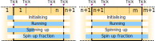

.. -----------------------------------------------------------------------------
     (c) Crown copyright 2024 Met Office. All rights reserved.
     The file LICENCE, distributed with this code, contains details of the terms
     under which the code may be used.
   -----------------------------------------------------------------------------

Model Time
==========

Not all models you come to write will need to consider the passage of time but
most will. The LFRic infrastructure provides a number of classes to help with
this.

The core is `model_clock_type` which implements a clock which tracks time steps.
It is initialised with a start and end step and provides a method to advance or
``tick()`` through the intermediate steps.

When a run must be broken down into parts the start of each part follows the
end of the previous part. Figure :numref:`clock_phase_summary` shows this.

Clock Phases
~~~~~~~~~~~~

The clock tracks a number of phases of operation and makes information about
these available through boolean signals. These are summarised in figure
:numref:`clock_phase_summary`.

.. _clock_phase_summary:

   Diagram illustrating phases of clock operation.

Initialising
------------

The "initialising" phase exists as a notional time step 0, before stepping
begins. Note that there is no actual step 0, if the clock is queried it will
report itself on time step 1 but ``is_initialisation()`` will return "true."

This phase exists mostly for infrastructure purposes so science developers are
unlikely to need it.

Running
-------

The "Running" phase exists between the first and last time step of the run.
The ``is_running()`` method will return "true" during this period but not after
the clock has stepped past the last time step of the run.

For conveniently creating time step loops the ``tick()`` method returns the new
value of ``is_running()`` when it is called.

Spinning Up
-----------

This phase represents the science concept of bringing the model up from start
to a stable state. It is controlled by the science code but managed by the
clock.

``is_spinning_up()`` tells you when you are in the spin-up period but often more
useful is the ``get_spinup_fraction()`` method which returns a real value between
0.0 and 1.0 indicating progress through the spin up period. Zero being the
start and one at the end and thereafter.

Simple Usage Example
~~~~~~~~~~~~~~~~~~~~

To illustrate use of the clock here is a simple example:

.. code-block:: fortran

    type(model_clock_type) :: clock

    clock = model_clock_type( first=1_i_timestep,            &
                              last=5_i_timestep,             &
                              seconds_per_step=1.2_r_second, &
                              spinup_period=3.0_r_second )

    do while (clock%tick())
        ! Do some science
    end do

Tick Events
~~~~~~~~~~~

The clock manages its own internal state on each tick but through use of
callback procedures it can also trigger user events. These are used by the I/O
system in order to dump checkpoints but they may be used by any infrastructure.

Event handlers are registered using ``add_event()``.

Future Work
~~~~~~~~~~~

The model clock is still in development and is missing some necessary and some
desirable features.

The Nature of Time
------------------

One of the goals of the model clock is that it never has to deal with human
concepts of time. These are messy social constructs without much physical
reality.

The step based abstraction of time, however, is not sufficient to drive the
radiation model which needs to understand orbital mechanics and therefore needs
some concept of the passage of physical time.

In order to satisfy radiation models the clock will be extended to provide two
simple quantities: Number of seconds since start of year (or the planet's
position in its stellar orbit) and number of seconds since start of day (or the
planet's position in its axial spin).

These may be calculated by simply adding :math:`\Delta t` to both tallies each
time step and zeroing them when going over the appropriate period. This tells
us these four quantities must be properties of the clock.

Clearly the two tallies must be initialised to the correct values which implies
that there must be some kind of calendar able to convert human dates into this
pair of second values.

Periodic Signalling
-------------------

Not everything in a model occurs every time step. It is not uncommon for an
event, such as calculating radiation, to occur every :math:`n` steps.

It is not a difficult calculation to take the modulo of the time step number and
:math:`n` and use that to gate a piece of code but since it is common and it
obviously fits with int he bailiwick of the clock we should provide for it.

The current design is for the user to register their interest in periodic
signalling by providing the periodicity. They will be given a handle which may
then be used each time step to ask the clock if the signal is raised.

Span Signalling
---------------

With periodic signalling in place it is an obvious hop to using it to
generalise the "spin-up" period into a generic period signalling mechanism.

This would work in much the same way as periodic signal but instead of a
start and period it would be specified as a start and end or start and
duration.

It would raise a query-able signal in the same way.
